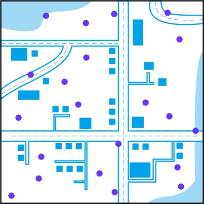
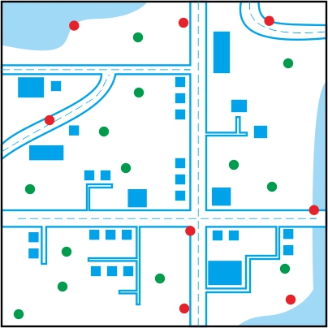
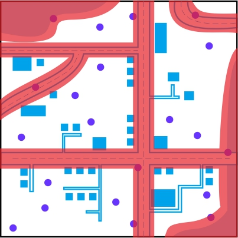
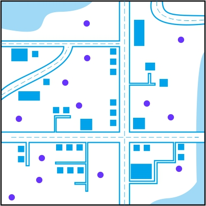
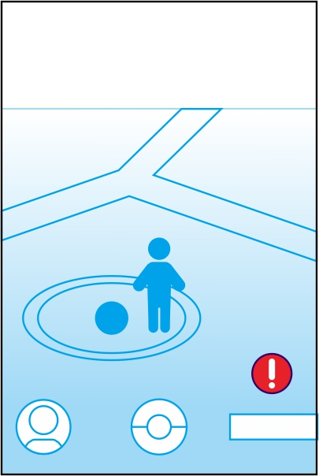
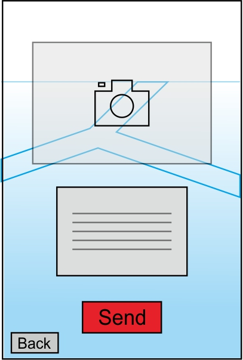
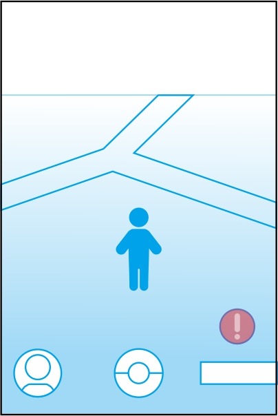

# Kamus Inggris Indonesia Offline by Daff Media #

# Game “Pokemon GO” tingkatkan angka kematian #
Dilansir dari berbagai media game Pokemon Go sudah banyak menyebabkan kerugian bahkan sampai merenggut nyawa di berbagai negara, seperti menyebabkan peningkatan kecelakaan lalu lintas dan maraknya kasus kriminal dengan memanfaatkan game Pokemon Go.

  

Di AS, meskipun masih bersifat spekulasi tetapi diperkirakaan Pokemon Go sudah menyebabkan angka kematian sebanyak 256 orang, cedera 29.370 orang, serta kerugian hingga 7,3 miliar dollar AS. Lain halnya di Jepang, media setempat memberi keterangan berdasarkan statistik Badan Kepolisian Nasional di Jepang bahwa tercatat ada 79 kecelakaan motor dan mobil, serta 700 surat tilang yang diterbitkan akibat dari game Pokemon Go hanya setelah dua pekan pertama game ini dirilis.

Selain dari penyebab kecelakaan lalu lintas, Pokemon Go menyebabkan naiknya angka kriminalitas, contohnya seperti kejadian dimana Pokemon Go dimanfaatkan untuk merampok para Gamer. Kepolisian Missouri menerima laporan perampokan di area O’Fallon bahwa ada sebanyak empat pelaku berusaha merampok sejumlah gamer yang berusia 16 sampai 18 tahun. Perampok itu menggunakan game tersebut untuk menjebak para korban ke dalam mobil BMW hitam yang diparkir di tempat terpecil ketika mereka sedang sibuk berburu pokemon. “menggunakan fitur geolokasi, para perampok bisa mengantisipasi lokasi para korban yang tidak sadar menjadi target ini”, ujar salah satu polisi setempat Bill Stringer.

## Penyebab ##

Hal ini umumnya disebabkan karena lokasi titik spawn Pokemon Go yang terlalu random tersebar sampai ketempat yang berbahaya/tidak seharusnya seperti dekat dengan jalan raya yang sangat ramai, dekat dengan tebing curam/sungai yang deras, bahkan tempat terpencil yang mana rawan dijadikan tempat/sarang para kriminalitas.

Player Pokemon Go sendiri masih kurang was was ketika bermain. Mereka tetap berburu pokemon dan tetap mencari/menjelajahi setiap pokemon di setiap titik spawn yang ada di aplikasi mereka tanpa memperhatikan kondisi daerahnya di dunia nyata di sekitaran lokasi titik spawn.

## Design Error ##

Pokemon Go menggunakan menggunakan data geografis OpenStreetMap (OSM) untuk membuat, mengkarakteristik, dan mendistribusikan titik spawn atau spawn points, hal ini lah yang memungkinkan munculnya berbagai macam titik lokasi spawn yang bebas/random dan terkesan realistis.

  

Titik spawn sangat random dan bebas seperti ini memang salah satu hal yang membuat Pokemon GO menarik, dengan menjelajah mencari pokemon ke suatu tempat yang bahkan baru memberikan pengalaman bermain game yang baru dan menyenangkan bagi para gamer khususnya pecinta serial Pokemon. 

Tapi hal inilah yang tidak disangka menjadi penyebab utama kecelakaan yang terjadi di dalam bermain Pokemon Go, titik spawn yang terletak dekat atau persis terletak dengan jalan raya/sungai menimbulkan ancaman kecelakaan. Player atau pemain cenderung berkumpul di titik rawan dengan hanya fokus untuk menangkap pokemon tanpa memperhatikan keadaan sekitarnya, tentunya itu membuat aktivitas para pengendara di area jalan raya itu terganggu sehingga terjadi kesalahan yang mengancam keselamatan orang orang disekitar.

  

## Solution ##

Dalam memperbaiki kelemahan dari sistem titik spawn ini kami memberikan dan menganjurkan 2 solusi, baik dari penyesuaian pada mekanisme titik spawn dan menambahkan sebuah fitur untuk digunakan para player/pemain Pokemon Go :

### 1. Membatasi/menghapus sejumlah titik yang dekat atau berada di daerah yang berbahaya ###

Dengan kembali menggunakan data dari OpenStreetMap, kami memanfaatkan data itu untuk mengidentifikasi lokasi yang berbahaya untuk dijadikan titik spawn atau dekat dengan titik spawn. Misalnya dengan menggunakan data OPM kami menentukan dan memberikan batas area minimal lokasi spawn setidaknya sejauh 20 meter dari jalan raya besar, sungai/danau, dan bangunan besar seperti pabrik atau perkantoran karena wilayah seperti itulah yang biasanya rawan menyebabkan kecelakaan atau gangguan aktivitas masyarakat. Titik spawn yang didalam area batas inilah yang akan kami non-aktifkan atau hilangkan. Pokemon, Gym, Pokestops tidak akan muncul sama sekali pada aplikasi bila berada di area ini, sebaliknya titik spawn yang berada diluar area/zona dekat dengan wilayah berbahaya itu tetap akan berkerja sesuai dengan mekanisme yang biasanya.

  
  &nbsp &nbsp
  

### 2. Memberikan fitur Report di dalam Aplikasi guna melaporkan jika ada lokasi yang sekiranya masih rawan bahaya meskipun berada di luar area berbahaya ###

Nantinya di dalam aplikasi, jika pemain telah mencapai area titik lokasi dan bila pemain merasa bahwa lokasi tersebut sedang menjadi atau berada diwilayah yang berbahaya, pemain dapat mengklik tombol report yang tersedia pada screen smartphone sebelum masuk ke mode menangkap pokemon. Jika pemain mengklik atau menggunakan fitur report ini, terdapat kolom untuk mengisi alasan pemain mengapa menganggap area tersebut berbahaya, button untuk mengambil sebuah gambar melalui kamera smartphone sebagai buktinya, dan button Kirim/Send untuk mengirimkan laporan itu. pemain diharuskan mengisi kolom yang disediakan untuk memberikan alasan kenapa area ini berbahaya terlebih dahulu serta wajib mengambil gambar sebelum bisa menggunakan button Send.

  
  &nbsp &nbsp
  

Nantinya laporan itu akan diaudit, dan jika terbukti memang benar titik spawn di area itu berbahaya, server akan menon-aktifkan titik spawn itu selama sementara atau permanen sesuai dengan kondisi tempat itu sendiri.

  

