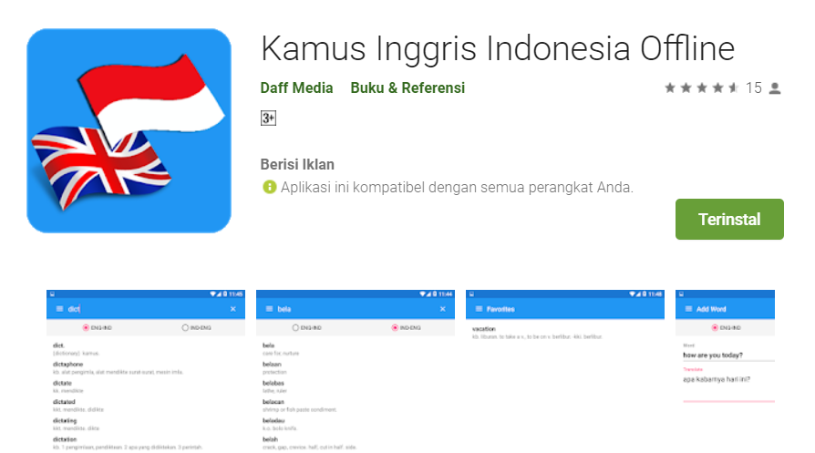

# Kamus Inggris Indonesia Offline by Daff Media #

  

Aplikasi yang kami ambil adalah Kamus Inggris Indonesia offline yang dipublish oleh Daff Media dan dapat dilihat pada tautan berikut:

https://play.google.com/store/apps/details?id=kamusinggris.kamusbahasainggris.kamusindonesiainggris

Kamus Inggris Indonesia Offline adalah aplikasi android berupa kamus untuk menerjemahkan bahasa indonesia ke bahasa inggris dan juga sebaliknya. Aplikasi ini bisa mencari kosakata tanpa memerlukan koneksi internet, jadi apabila ingin mencari kosakata dalam bahasa indonesia maupun bahasa inggris secara offline bisa langsung digunakan. Fitur yang ada pada aplikasi ini diantaranya yaitu, fitur kata favorit, menambahkan kata-kata atau kalimat sendiri, tenses, dan kosakata/kalimat harian yang sering digunakan. Aplikasi ini telat didownload seribu kali di Google Playstore.

## Give reasoning why it isn't pleasant or cumbersome to use ##

Aplikasi ini memiliki tampilan yang sama seperti aplikasi kamus lain pada umumnya. Tetapi pada saat kami menggunakan aplikasi ini, kami mengalami sedikit kesulitan dalam memahami cara menggunakan aplikasi tersebut. Kemudian beberapa kekurangan yang telah kami temukan selama menggunakan aplikasi ini yaitu :

1. First Impression pertama kali ketika membuka aplikasi ini langsung menampilkan halaman awal kamus, yang dimana belum menampilkan isi dari kamus tersebut karena untuk menampilkan kata harus mengisi kata pada search box. Hal yang kami anggap masalah disini yaitu, pada awal ketika membuka aplikasi, layar utamanya menunjukkan icon "No item" yang malah memberi kesan bahwa kamus itu kosong tidak ada isinya. Alangkah lebih baik apabila kata tersebut diganti "search a word" sehingga kita bisa mencari kata di search box.
2. Search box yang berada di navbar sulit untuk dinotice. Umumnya search box pada aplikasi android tidak terdapat pada navbar, biasanya navbar berisi title aplikasi tersebut. Search box yang seperti ini menjadikan search box itu sendiri sulit dinotice, apalagi ditambah ketika membuka aplikasi menampilkan "No Item" jadi user tidak langsung menyadari kalau harus mengisi search box terlebih dahulu. Saran dari kamu yaitu membuat search box sendiri di bawah tab "ENG-IND" dan "IND-ENG" sehingga user tidak bingung.
3. Pada materi tenses tombol "kembali" berada di paling bawah. Ketika ke menu tenses dan memilih materi, maka aplikasi akan menampilkan materi tersebut, tetapi user yang ingin kembali ke daftar materi tenses kesulitan karena tombol back berada di bagian paling bawah materi tersebut sehingga user harus menscroll terlebih dahulu. Terlebih lagi ketika kami memencet tombol 'back' pada smartphone malah menu sidebar yang terbuka bukannya kembali ke menu tenses. Perbaikan untuk masalah ini kami menyarankan untuk memberikan tombol navigasi di bagian atas ketika membuka suatu materi bacaan.
4. Pada materi vocabulary tombol "kembali" berada di paling bawah. Permasalahan ini sama dengan yang sebelumnya, dan kami juga menyarankan hal yang sama dengan yang sebelumnya.
5. Pada menu favorit, kata yang difavoritkan tidak dipisah antara kata bahasa indonesia dengan kata bahasa inggris.
6. Menu Vocabulary terlihat materinya berulang sehingga tidak sedap dipandang.

## Pointed out the flaw in interaction control ##

Pada bagian interaksi kontrol penggunaan aplikasi ini, terdapat beberapa hal yang kami rasakan cukup mengganggu dalam penggunaan aplikasi ini. Hal-hal yang kami rasakan sebagai bentuk kelemahan dalam kontrol interaksi yaitu:

1. Kesalahan ketika menekan tombol back pada smartphone. umunya pada saat menggunakan aplikasi ketika kita sedang berada dalam sebuah halaman dan ingin kembali ke halaman sebelumnya, kita akan menggunakan tombol back pada smartphone jika tidak terdapat atau tersedia icon back pada halaman tersebut. Tetapi dalam aplikasi ini ketika kita menekan tombol back pada smartphone, bukannya kembali pada halaman sebelumnya, malah memunculkan menu sidebar ketika tombol back ditekan. Ini akan membingungkan/merepotkan pengguna khususnya pada bagian tenses dan vocabulary, contohnya ketika pengguna berada pada halaman isi "13. simple past futur" dan pengguna ingin kembali ke halaman sebelumnya untuk memilih halaman "14. Past future continuous" dengan menekan tombol back pada smartphone, pengguna akan kebingungan karena malah muncul menu dari side bar, mau tidak mau pengguna akan menekan kembali menu tenses dan menscroll lagi kebawah untuk kembali menuju ke halaman "14. Past futre continuous" yang ingin dimaksudkan tadi.
2. Pada bagian translate, aplikasi ini hanya mampu mentranslate sebuah kata saja bukan sebuah kalimat. Ketika pengguna menuliskan lebih dari dua kata hasil translate sebelumnya akan hilang begitu saja, hal ini akan membuat pengguna bingung terlebih lagi tidak ada pesan yang memberitahu/menggingatkan pengguna bahwa aplikasi hanya mampu mentranslate satu kata saja.
3. Kesalahan fitur voice pada halaman translate di bagian bahasa indonesia. Fitur voice yang digunakan untuk melafalkan kata bahasa inggris baik baik saja, tetapi berbeda pada saat melafalkan kata indonesia di bagian halaman translate "IND-ENG". Alih alih menggunakan voice dengan pelafalan bahasa indonesia, voice ini malah melafalkan kata dengan pelafalan bahasa inggris.

## Identify Key business use cases ##

Fitur kunci yang ada di aplikasi ini, yaitu:
1. Pencarian kata dalam bahasa inggris atau indonesia dan hasil terjemahannya.
2. Fitur belajar tenses dan vocabulary.
3. Fitur simpan kata atau kalimat.

## Activity Diagrams

Gambar 1
gambar 2
gambar 3
gambar 4
